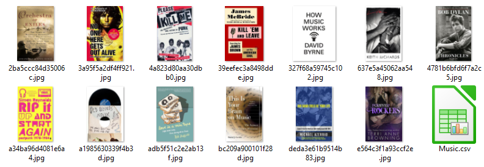

# Scrap bookstore v1
**_Projet réalisé lors de ma formation de Développeur d'application Python à OpenClassrooms_**

_**Scrap_bookstore is a program that extracts data from online bookstore(web scraping) using BeautifulSoup Python Library.**_

## How to create and activate virtual environnement

* Assumption: python 3.9.1 already installed.

* Create a new directory in Windows and store the scrap_bookstore.py and requirements.txt files in it.

* Open a new windows 10 terminal with the cmd command.

* Check the python version and open the python interpreter `python`

* Exit the python interpreter `exit()`

* Create the virtual environnement `python -m venv env`

* Activate the virtual environnement `env\Scripts\activate.bat` in cmd or `.\env\Scripts\Activate.ps1` in powershell

* Remark, to desactivate the virtual environnement `deactivate`

* Install the lastest version of pip: `python -m pip install --upgrade pip`

* Remark, to check the installed version of pip `pip show pip`

* Instal the required python packages `pip install -r requirements.txt`

* Remark, check the installed packages `pip freeze or >pip list`

## How to run the pyton script

* First, you need to delete Bookstoscrape directory if it exists.

* Open a new windows 10 terminal with the cmd command.

* Activate the virtual environnement `env\Scripts\activate.bat`

* Run the python script `python scrap_bookstore.py`

* You will find the book covers and the books data in directory Bookstoscrape

